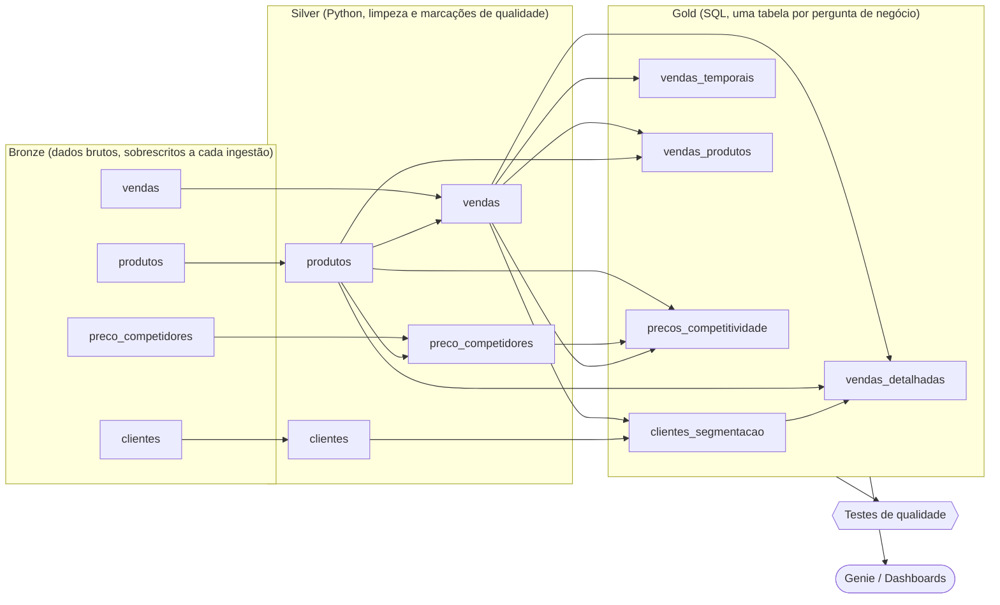

# E-commerce Data Platform AI

Pipeline de dados ponta a ponta para um e-commerce brasileiro no **Databricks**. Usa **arquitetura medalhão** (Bronze → Silver → Gold), **Lakeflow Spark Declarative Pipelines**, deploy como código com **Declarative Automation Bundles (DABs)** e uma camada gold documentada para ser consultada por **agentes de IA (Genie)** em linguagem natural.

Todo o projeto foi construído com **engenharia assistida por IA**: um agente (Claude Code) trabalhou dentro de convenções escritas no repositório ([`CLAUDE.md`](CLAUDE.md)), guiado por prompts versionados ([`.llm/`](.llm/)). Cada etapa foi validada com testes de qualidade e com a conferência de números de referência.

---

## Problema de negócio

Três diretorias precisavam de respostas confiáveis a partir dos mesmos dados brutos de vendas, produtos, clientes e preços de concorrentes:

| Diretoria | Pergunta | Tabela gold |
|---|---|---|
| **Customer Success** | Quem são os melhores clientes, onde estão e em que segmento cada um cai? | `gold.clientes_segmentacao` |
| **Comercial** | Quanto vendemos, quando (dia, hora, dia da semana), em qual canal e com quais produtos? | `gold.vendas_temporais`, `gold.vendas_produtos`, `gold.vendas_detalhadas` |
| **Pricing** | Estamos mais caros que Mercado Livre, Amazon, Magalu e Shopee? Em quais produtos agir? | `gold.precos_competitividade` |

## Arquitetura



Um **Job** do Databricks orquestra a execução: atualiza o pipeline e, só se ele terminar com sucesso, roda o notebook de testes de qualidade. Se algum teste falha, o Job fica vermelho.

## Stack

- **Databricks** com Unity Catalog (catálogo `projetodados`, schemas `bronze`, `silver`, `gold`)
- **Lakeflow Spark Declarative Pipelines** serverless: silver em **PySpark** (`pyspark.pipelines`), gold em **SQL**
- **Materialized views** com leitura batch
- **Declarative Automation Bundles** (infraestrutura como código, targets `dev` e `prod`)
- **Lakeflow Jobs** para orquestração
- **Claude Code** como agente de desenvolvimento

## Decisões de engenharia

As regras abaixo estão justificadas nos comentários do começo de cada arquivo:

- **Materialized views, nunca streaming tables.** A bronze é sobrescrita a cada ingestão, então cada execução recalcula tudo a partir do estado atual.
- **Nunca descartar vendas.** Problemas conhecidos da origem são **marcados em colunas** e **medidos** com `@dp.expect` (warn), sem apagar linhas. Apagar venda mudaria a receita.
  - `produto_cadastrado = false`: venda de produto que não existe no cadastro (20 vendas, R$ 4.240,01).
  - `venda_antes_do_cadastro = true`: venda anterior à data de criação do produto.
  - `preco_suspeito = true`: concorrente cobrando menos de 60% do nosso preço.
- **Falha só para o impossível.** `@dp.expect_all_or_fail` para chaves nulas, preços ou quantidades não positivos, canal inválido e UF sem região. Se isso acontecer, a origem quebrou e o pipeline para.
- **Dinheiro sempre em `DECIMAL(10,2)`**, com `CAST` explícito depois de `SUM`/`AVG`, para a receita bater ao centavo.
- **Receita inclui tudo, inclusive produto não cadastrado:** dinheiro que entrou é receita. Na gold, esses produtos aparecem como "Produto não cadastrado" / "Não cadastrado" em vez de sumirem num `NULL`.
- **Rankings sem empate** (`ROW_NUMBER` com desempate pela chave), estáveis entre execuções.
- **Segmentação baseada nos dados:** os limites antigos deixavam 49 dos 50 clientes como VIP. Os limites novos (VIP ≥ R$ 22.000, TOP_TIER ≥ R$ 17.000) foram definidos a partir da distribuição real da receita.

## Pronto para IA: gold documentada para o Genie

O Genie gera SQL lendo os metadados das tabelas. Por isso, toda tabela gold declara **todas as colunas com tipo e `COMMENT` em português**, com unidade (R$), regra de cálculo e avisos que evitam erros comuns. Alguns exemplos:

- `clientes_unicos`: *"não some esta coluna entre linhas; para clientes únicos no período use gold.clientes_segmentacao"*
- `nome_produto`: *"produtos diferentes têm o mesmo nome; para contar produtos use id_produto"* (há 82 nomes repetidos no cadastro)
- `diferenca_pct_vs_media`: *"em pontos percentuais: 10 = 10% mais caro"*
- `receita` em `precos_competitividade`: *"a soma desta coluna NÃO é a receita total da empresa"*

O `COMMENT` de cada tabela diz **quando usá-la** e aponta a tabela certa para outros tipos de pergunta. Um teste garante que nenhuma coluna da gold fique sem comentário.

## Qualidade de dados

A qualidade é verificada em duas camadas:

1. **Expectations no pipeline**, linha a linha (`warn` para o que é conhecido e tolerado, `fail` para o impossível).
2. **Notebook de testes** ([`testes/testes_qualidade.py`](testes/testes_qualidade.py)), com 18 testes sobre as tabelas inteiras:
   - chaves únicas em todas as tabelas;
   - receita de cada gold igual à da silver (nenhuma venda perdida ou duplicada nos joins);
   - `vendas_detalhadas` com o mesmo número de linhas da silver, e toda venda com segmento e região;
   - produto não cadastrado abaixo de 1% das vendas;
   - segmentos válidos e coerentes com os limites;
   - todas as colunas da gold comentadas.

### Números de referência

Números conferidos em cada execução:

| Métrica | Valor |
|---|---|
| Vendas no período (13/12/2025 a 11/01/2026) | 3.020 |
| Receita total | R$ 974.077,28 |
| Vendas no ecommerce / loja física | 2.155 / 865 |
| Clientes (VIP / TOP_TIER / REGULAR) | 50 (10 / 25 / 15) |
| Produtos com preço de concorrente | 215 |
| Produtos mais caros que todos os concorrentes | 35 |
| Produtos com preço de concorrente suspeito | 15 |

## Alguns resultados

- **O ecommerce responde por 72% da receita:** R$ 705,5 mil contra R$ 268,6 mil da loja física.
- **O Norte é a região que mais fatura** (R$ 333,1 mil), à frente de Nordeste (R$ 216,2 mil) e Centro-Oeste (R$ 179,1 mil).
- **35 produtos estão mais caros que todos os concorrentes.** Os 15 produtos com preço de concorrente suspeito estão todos nesse grupo: antes de baixar o preço, é preciso confirmar se o concorrente está numa promoção relâmpago ou se foi erro de coleta.

## Estrutura do repositório

```
├── databricks.yml                      # Bundle: targets dev/prod e variáveis
├── resources/
│   ├── projetodados_etl.pipeline.yml   # Pipeline serverless (Lakeflow)
│   └── pipeline_ecommerce.job.yml      # Job: pipeline → testes de qualidade
├── src/projetodados_etl/transformations/
│   ├── silver/                         # Uma tabela por arquivo, em PySpark
│   │   ├── clientes.py
│   │   ├── produtos.py
│   │   ├── vendas.py
│   │   └── preco_competidores.py
│   └── gold/                           # Uma tabela por arquivo, em SQL
│       ├── clientes_segmentacao.sql
│       ├── vendas_temporais.sql
│       ├── vendas_produtos.sql
│       ├── vendas_detalhadas.sql
│       └── precos_competitividade.sql
├── testes/testes_qualidade.py          # Testes executados pelo Job
├── .llm/                               # Prompts usados em cada etapa
├── CLAUDE.md                           # Convenções do projeto para o agente de IA
└── AGENTS.md
```

## Desenvolvimento assistido por IA

O projeto foi construído em quatro etapas, cada uma com um prompt versionado em [`.llm/`](.llm/):

1. **Silver:** explorar a bronze, levantar problemas de qualidade e construir as 4 tabelas limpas.
2. **Gold de Customer Success:** segmentação de clientes.
3. **Gold Comercial:** vendas por tempo, canal e produto, mais a tabela detalhada para perguntas que cruzam diretorias.
4. **Gold de Pricing:** competitividade de preços contra 4 marketplaces.

O [`CLAUDE.md`](CLAUDE.md) funciona como contrato entre o time e o agente: convenções de nomes, tipos, regras de qualidade, padrão das golds e números de referência. Assim o agente produz código consistente entre as etapas, e qualquer desvio aparece nos testes.

## Como executar

Pré-requisitos: [Databricks CLI](https://docs.databricks.com/dev-tools/cli/install) autenticada em um workspace com Unity Catalog e as tabelas `projetodados.bronze.*` disponíveis.

```bash
# 1. Validar o bundle
databricks bundle validate --strict --profile <perfil>

# 2. Fazer o deploy em desenvolvimento
databricks bundle deploy -t dev --profile <perfil>

# 3. Rodar o Job (pipeline + testes de qualidade)
databricks bundle run pipeline_ecommerce -t dev --profile <perfil>

# Produção
databricks bundle deploy -t prod --profile <perfil>
```

---

Autor: [Lopess01](https://github.com/Lopess01)
